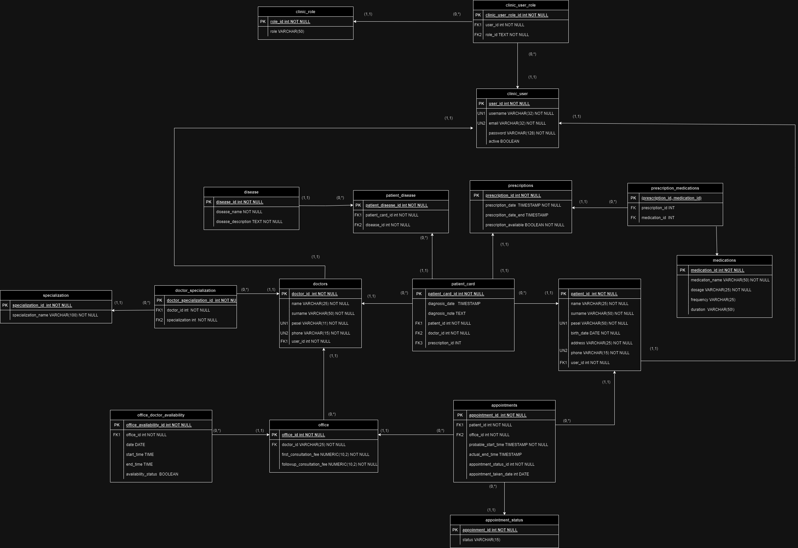

Web Clinic is an application designed for managing medical clinic appointments. It is developed using Java and the Spring Boot framework, with PostgreSQL as the underlying database. The project follows the Model-View-Controller (MVC) pattern and utilizes REST APIs. It offers a separate security configuration based on JWT tokens for the API layer and session management using cookies for the MVC layer.

The application is structured in a layered architecture where each layer interacts with dedicated models, including Data Transfer Objects (DTO), Domain, and Entity. This architecture enables efficient data and process management within the system.

The application has undergone comprehensive testing to ensure code quality and functionality. Various types of tests have been conducted:

Unit tests make use of well-known tools such as JUnit and Mockito. For more information and examples of unit tests, please refer to the src/test directory.

Integration tests employ technologies like Testcontainers, allowing for the running of Docker containers during testing, and Rest Assured for testing the integration of components.
## Demo

To try out the application, visit the [Demo Web Clinic](http://ec2-35-156-99-173.eu-central-1.compute.amazonaws.com:8080/web-clinic/) ((the application uses HTTP).

Sample login credentials are as follows:

- For patient:
    - Username: patient1
    - password: test

- For Doctor:
    - Username: doctor1
    - password: test


The API documentation is available in Swagger at [ Documentation.](http://13.53.197.245:8080/web-clinic/swagger-ui/index.html)
Sample request bodies for login (the application in the REST layer uses JWT authentication).
```json
{
  "username": "patient1",
  "password": "test"
}
```
```json
{
  "username": "doctor2",
  "password": "test"
}
```
## Features

The Web Clinic application offers a variety of features, including:

- Registration for patients and doctors.
- Browsing available appointment slots.
- Booking and managing appointments.
- Viewing appointment history.
- After a doctor's appointment with a patient, the doctor can add notes to the appointment.
- The application allows doctors to specify their availability dates for potential appointments.
- Patients can view the history of past appointments and check upcoming appointment dates.
- Patients can review notes written by the doctor as part of the completed appointment.
- Patients can cancel appointments.

## Technologies
- Java 17
- Spring MVC and REST Controller
- Spring Boot 3.1
    -  Spring Data JPA, Thymeleaf, Validation, Web, Security (session, jwt)
-  Hibernate 
-  SpringDoc OpenAPI (Swagger)
- Java JSON Web Token (JWT)
-  Project Lombok
-  MapStruct
-  PostgreSQL
-  Flyway
- SL4J, Logback
- Docker (deploy)
- AWS for demo
- Test:
    - Spring Security Test
    - Spring Boot Starter Test (MockMVC, Mockito, DataJpaTest)
    - Testcontainers
    - JUnit 5
    - RestAssured
    - JaCoCo

## Installation and startup

🐳 To run tests, [install Docker](https://docs.docker.com/engine/install/)  is required.

If you want to run this application locally on your computer, follow these steps:
1. Download the source code from this repository:

   ```shell
   git clone https://github.com/lukocu/web-clinic.git
    ```

2. The configuration files for the database are located in `src/main/resources/application.properties`


3. The api (Swagger) documentation should be found under:
   ` localhost:XXXX/web-clinic/swagger-ui/index.html`

## Database diagram

The database generates keys in tables using sequences defined in Flyway migrations, and seed data is also loaded from Flyway migrations.

The diagram is located at `src/main/resources/Diagram_ERD.png`.


